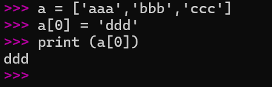

# PYthon 心得


我是用wsl下nano文本编辑器来编写py，每次编译都要输入python3 有点麻烦才会这样弄


## **注释**
```
1.单行->#

2.多行->'(3个包裹)
```
备注：多行的注释 赋值 给变量 也可以打印 多行 多段

## **打印**
1. `print`

2. `title()` ->首字母大写

3. `upper()` ->全字母大写

4. `lower()` ->全字母小写

5. `f" {}"  |   f{} {}`   -> 方法 变量  字符串 的链接   <u>f后面不能有空格</u>

## **删除空格**

1. `变量名.rstrip()`   <u>暂时性</u> 删除空格并输出      右空格

2. `变量名.lstrip()`                                     左空格

3. `变量名.strip()`                                     两端空格
 
**删除前缀**		
`变量名.removeprefix `(   ‘ <u>删除的值</u> ’   )    暂时性删除显示，只能删前面

 **删除后缀**		
`变量名.removesuffix` (   ‘ <u>删除的值</u> ’   )    暂时性删除显示，只能删前面


## **列表管理**

	列表变量名字 = [ 'value1','value2',...]

### 1. 访问单个元素


>与C语言类似<br>
>
>	int a ={1,2,3,4}, b; <br>
>
>	b = a[0];<br>
>
>但不一样的是python 可以直接,<br> 
>
>	a = ['1','3','4','5']<br>
>
>	print(a[0]) <br>
>
>可以想象成链表一样的存在->单向非循环链表

**索引是从0开始（可能计算机都这样）**

<u>py可以是 [-1] 代表末尾最后一个元素</u> 


### 2. 修改元素

例子<br>
```
a = ['aaa','bbb','ccc']
a[0] = 'ddd'
print (a[0])
```
 
---
### 3. 增添元素
 
 - 在末尾增添元素
	
	方法：`[列表变量名].append('[value]')`
	
	例如：name_list.append('张三')

- 在列表位置插入元素

	方法：`[列表变量名].insert([number],'[value]')`
	>根据列表元素所在位置[number]插入值[value]

### 4. 删除元素

- 使用`del`语句删除元素
	
	```
	ce_shi = ['aa','bb','cc']

	del ce_shi[0]
	```

- 使用`pop`语句删除元素

	```
	ce_shi = ['aa','bb','cc']

	b = ce_shi.pop()
	```
	>这是 默认 的 弹出 末尾元素

	```
	ce_shi = ['aa','bb','cc']

	b = ce_shi.pop(0)
	```
	>这是 指定 的 弹出 列表 第一个 元素


>del 与 pop 的 **区别**
>
>del是**指定删除**
>
>pop 又名为**弹出** ，从列表 **弹出** 元素所在**值**,可以赋值给其他变量


### 5. 根据值删除元素

方法：`[列表变量名].remove('[value]')`

例如：
```
name_list.remove('张三')
```
>这里的是 删除列表值为张三 的元素
```
a = '张三'
name_list.remove(a) 
```
>这里的值也可以是变量 

清空列表可以用 .clear() 方法
```	
name_list.clear()
```

### 6. 列表的排序

- 顺序

	方法：`[列表变量名].sort()`
	```
	cars = ['bmw','audi','toyota','subaru']
	cars.sort()
	print (cars)
	```
	>这是永久排序，根据字母，数字

- 逆序

	方法：`[列表变量名].sort(reverse=True)`
	```
	cars = ['bmw','audi','toyota','subaru']
	cars.sort(reverse=True)
	print (cars)
	```

- **临时**排序（支持逆序）

	方法：`sorted([列表变量名])`
	```
	cars = ['bmw','audi','toyota','subaru']
	print (sorted(cars))
	```
	>这是临时排序，不会改变原列表

	```
	cars = ['bmw','audi','toyota','subaru']
	print (sorted(cars, reverse=True))
	```
	>这是临时逆序排序
	>不会改变原列表
- 反转列表

	方法：`[列表变量名].reverse()`
	```
	cars = ['bmw','audi','toyota','subaru']
	cars.reverse()
	print (cars)
	```
	>这是**永久**反转列表
 
  ```
  cars = ['bmw','audi','toyota','subaru']
  cars.reverse()
  #第二次使用.reverse()方法，复原
  cars.reverse()
  print(cars)
  ```
	>**两次反转会恢复原列表**
	>
	>注意：不是排序
- 计算列表长度
	方法：`len([列表变量名])`
	```
	cars = ['bmw','audi','toyota','subaru']
	print (len(cars))
	```
	>这是计算列表长度